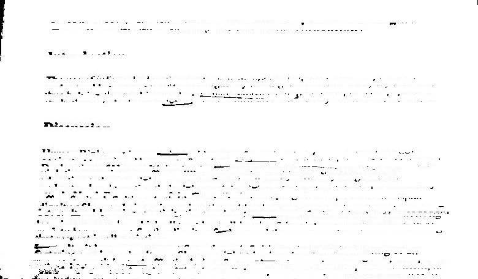

# Removing-Hand-Written-Annotations
Repository for the project of removing hand-written annotations from scanned document.

## Task-1: Binarizing the Image

* For this task, we are using OTSU algorithm in the OpenCV library to binarize the image of the document and saving it as imgnew.jpg.

### Image before Binarization

### Image after Binarization

## Task-2: Finding the connected components in the Image

* Now, for proceeding further, we are using the Breadth First Search(BFS) to find the connected components by first converting the binarized image to a list of RGB values and then applying the BFS algorithm to find the heights and widths of the connected components and then storing the result in <a href="heightandwidth.txt">heightandwidth.txt</a>

## Task-3: Extracting the annotations part from the Image

* In the <a href="blackpixels.py">blackpixels.py</a> file, we are first calculating the number of black pixels in a row and then by setting a threshold, we are extracting the part in which only the annotations and white gaps between the lines are present.

* After this, we are using the matplotlib imshow to generate an image consisting only the rows which we got as an output from the above approach.

### Image containing the Annotations and the Blank Spaces between the Lines

